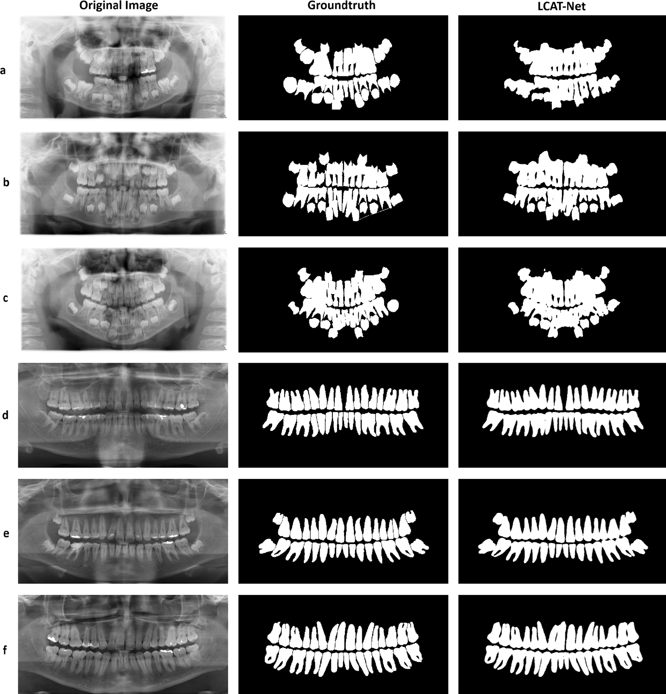

# LCAT-Net: Lightweight Context-Aware Deep Learning Approach for Teeth Segmentation in Panoramic X-rays

## Overview

LCAT-Net is a deep learning model designed to segment teeth in panoramic X-ray images accurately. By preserving both contextual and fine-grained details, LCAT-Net addresses challenges such as blurred interdental boundaries, noise variations, and overlapping dental structures. The model introduces a novel Multi-scale Context Fusion (MCF) block to effectively capture and fuse features from multiple scales, enabling more accurate segmentation of dental structures of varying sizes and orientations. Additionally, a dense skip connection module (DSM) allows each decoder layer to combine details from the symmetric encoder layer and all upper encoder layers. The model was trained and tested on three datasets: children, adult, and combined, to ensure its robustness across different age groups.


## Comparison with Previous Segmentation Networks
**Children dataset (a):**
| Architecture    | Recall ± Std | Spe ± Std  | Acc ± Std  | IoU ± Std  | Dice ± Std  |
|---------------|-------------|------------|------------|------------|------------|
| U-Net [26]     | 0.9200±0.0675 | 0.9883±0.0069 | 0.9710±0.0062 | 0.8387±0.0300 | 0.9120±0.0182 |
| R2 U-Net [27]  | 0.8540±0.0879 | 0.9849±0.0057 | 0.9675±0.0061 | 0.8374±0.0268 | 0.9027±0.0375 |
| PSPNet [28]    | 0.8486±0.0162 | 0.9910±0.0059 | 0.9687±0.0048 | 0.8122±0.0229 | 0.8920±0.0183 |
| DeepLab V3+ [29] | 0.9428±0.0136 | 0.9899±0.0045 | 0.9714±0.0023 | 0.8567±0.0132 | 0.9235±0.0147 |
| **LCAT-Net (Ours)** | 0.9948±0.0104 | 0.9895±0.0028 | 0.9714±0.0023 | 0.8576±0.0132 | 0.9235±0.0147 |

**Adult dataset (b):**
| Architecture    | Recall ± Std | Spe ± Std  | Acc ± Std  | IoU ± Std  | Dice ± Std  |
|---------------|-------------|------------|------------|------------|------------|
| U-Net [26]     | 0.9454±0.0231 | 0.9789±0.0119 | 0.9719±0.0083 | 0.8586±0.0274 | 0.9320±0.0162 |
| R2 U-Net [27]  | 0.9208±0.0218 | 0.9732±0.0107 | 0.9680±0.0076 | 0.8524±0.0236 | 0.9244±0.0171 |
| PSPNet [28]    | 0.9334±0.0208 | 0.9772±0.0100 | 0.9705±0.0065 | 0.8550±0.0220 | 0.9267±0.0171 |
| DeepLab V3+ [29] | 0.9466±0.0148 | 0.9782±0.0104 | 0.9700±0.0050 | 0.8590±0.0225 | 0.9290±0.0171 |
| **LCAT-Net (Ours)** | 0.9646±0.0128 | 0.9808±0.0072 | 0.9755±0.0046 | 0.8959±0.0204 | 0.9444±0.0149 |

**Combined dataset (c):**
| Architecture    | Recall ± Std | Spe ± Std  | Acc ± Std  | IoU ± Std  | Dice ± Std  |
|---------------|-------------|------------|------------|------------|------------|
| U-Net [26]     | 0.9434±0.0261 | 0.9759±0.0110 | 0.9718±0.0080 | 0.8812±0.0110 | 0.9365±0.0183 |
| R2 U-Net [27]  | 0.9360±0.0219 | 0.9733±0.0113 | 0.9690±0.0071 | 0.8572±0.0230 | 0.9278±0.0193 |
| PSPNet [28]    | 0.9334±0.0208 | 0.9772±0.0100 | 0.9705±0.0065 | 0.8550±0.0220 | 0.9267±0.0171 |
| DeepLab V3+ [29] | 0.9516±0.0129 | 0.9783±0.0092 | 0.9706±0.0053 | 0.8584±0.0206 | 0.9285±0.0182 |
| **LCAT-Net (Ours)** | 0.9686±0.0128 | 0.9788±0.0076 | 0.9744±0.0043 | 0.8846±0.0206 | 0.9450±0.0114 |

## Output samples


## Access the Code

The implementation of LCAT-Net is available in the following Jupyter Notebook:
[LCAT-Net notebook (kaggle)](https://www.kaggle.com/code/kanouar/lcat-net-lightweight-context-aware-network)
[]([https://colab.research.google.com/github/johndoe/my-project/blob](https://www.kaggle.com/code/kanouar/lcat-net-lightweight-context-aware-network))
This notebook provides a comprehensive walkthrough of the model architecture, training process, and evaluation metrics. Users can interact with the code, modify parameters, and visualize results directly within the notebook.

## Citation

If you find LCAT-Net useful in your research or applications, please consider citing our work:

```bibtex
@article{khaldi2024lcat,
  title={LCAT-Net: Lightweight Context-Aware Deep Learning Approach for Teeth Segmentation in Panoramic X-rays},
  author={Khaldi, Anouar and Khaldi, Belal and Aiadi, Oussama},
  journal={International Journal of Computational Intelligence Systems},
  volume={17},
  number={1},
  pages={1--17},
  year={2024},
  publisher={Springer}
}
```

For more details, you can access the full article [here](https://doi.org/10.1007/s44196-024-00703-5).

## License

This project is licensed under the Creative Commons Attribution-NonCommercial-NoDerivatives 4.0 International License. This permits any non-commercial use, sharing, distribution, and reproduction in any medium or format, as long as appropriate credit is given to the original authors and source. For more details, please refer to the [license terms](https://creativecommons.org/licenses/by-nc-nd/4.0/).


For any questions or further information, please get in touch with the corresponding author:

**Anouar Khaldi**

Department of Computer Science and Information Technologies, Kasdi Merbah University, Ouargla, 30000, Algeria
Email: [kld.anouar@gmail.com](mailto:kld.anouar@gmail.com)

We appreciate your interest in LCAT-Net and welcome any feedback or contributions to enhance this work.
